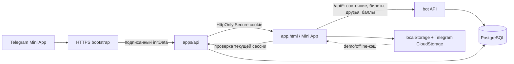

# Карта текущего приложения

Статус: baseline ветки `feat/app`; карта «Мир» не входит в запущенное приложение.
Факты сверены с исходным кодом. Реальная Telegram-среда и deployment этим документом
не считаются проверенными.

Начинайте навигацию с [индекса документов](index.md). Процедура переноса контекста конкретной
ветки: [handoff guide](handoff-guide.md) и автоматически обновляемый [снимок ветки](handoffs/branch-context.md).

## Границы модулей

| Область | Владелец | Ответственность |
|---|---|---|
| Telegram Mini App | `index.html`, `registration.js`, `assets/js/data/` | Экран дерева, взаимодействия, клиентская модель демо/offline-данных, обмен/повторное использование сессии |
| Бренд и ресурсы | `assets/brand/` | Логотип SVG и путь, используемый Canvas-сценой |
| Геометрия сцены | `assets/js/scene/geometry.js` → `tools/build-scene-data.mjs` → `assets/generated/scene-data.js` | Алгоритм и сгенерированные числа сцены; после правки `TIERS`/`BRANCHES` в `economy.js` или алгоритма — `npm run build:scene` ([ресурсы](assets.md)) |
| Контракты | `packages/contracts/` | Runtime-схемы запросов и ответов API |
| API идентичности | `apps/api/src/auth/` | Telegram-проверка, регистрации, сессии; доменные интерфейсы лежат в `auth.models.ts`, SQL — в `auth.repository.ts` |
| Telegram-бот | `bot/bot.js`, `bot/storage.js` | Bot API, реферальные сценарии, счета, `successful_payment`, баллы и администрирование |
| Серверное состояние | `db/migrations/` | Единственная декларация схемы PostgreSQL; новые изменения — только новыми миграциями |
| Конфигурация и выпуск | `config.js`, `docker/`, `Dockerfile` | Публичная конфигурация UI и упаковка контуров dev/prod |

`index.html` остаётся большим UI-файлом, но больше не владеет схемой клиентских сущностей,
классом хранения, разбором attribution и кэшем баллов. Эти границы не меняют формат старых
ключей localStorage.

## Поток входа и данных

Перед загрузкой UI bootstrap проверяет `/api/v1/session` и переиспользует cookie только когда
`/api/v1/me` совпадает с текущим Telegram ID; при отсутствии сессии или другой identity он
обменивает подписанный `initData`. `registration.js` повторяет эту проверку для прямой загрузки
защищённой страницы. Bot API остаётся отдельным владельцем `/api/*`, а TypeScript API
обслуживает `/api/v1/*`.

## Источники истины

- PostgreSQL хранит серверную идентичность и сессии, счета и квитанции, награды активности.
  Список открытых узлов беты — настройка контура `BETA_OPEN` (`bot/beta-config.js`),
  меняется деплоем: [перенос из `beta_settings`](beta-config.md).
- Клиентские ключи `rizzoma_mock_db`, `rizzoma_me`, `rizzoma_attribution`,
  `rizzoma_claims`, `rizzoma_beta` и `rizzoma_engagement` обслуживают демо, offline-показ
  и кэш. Подробно: [модель данных и повторных операций](data-and-idempotency.md).
- Claim скилла — локальный прогресс интерфейса. Его нельзя использовать как подтверждение
  права на денежную или иную серверную награду.

## Документы по теме

- [Разбор исторических prompt-файлов](prompt-analysis.md) — извлечённые требования,
  принятые решения и расхождения со старой формулировкой.
- [Истории пользователей и критерии приёмки](user-stories.md) — базовый Mini App, бот,
  платежи, баллы и эксплуатация.
- [Ресурсы и брендовые файлы](assets.md) — где лежат SVG и как UI их использует.
- [Проверка базового приложения](review-baseline.md) — найденные риски и ограничения.
- [Контуры и выпуск](environments.md) — целевая модель и проверенные границы окружений.

Документы `world-map-*` описывают будущее отдельное направление. Они не являются
описанием текущей схемы API или готовой функции.
